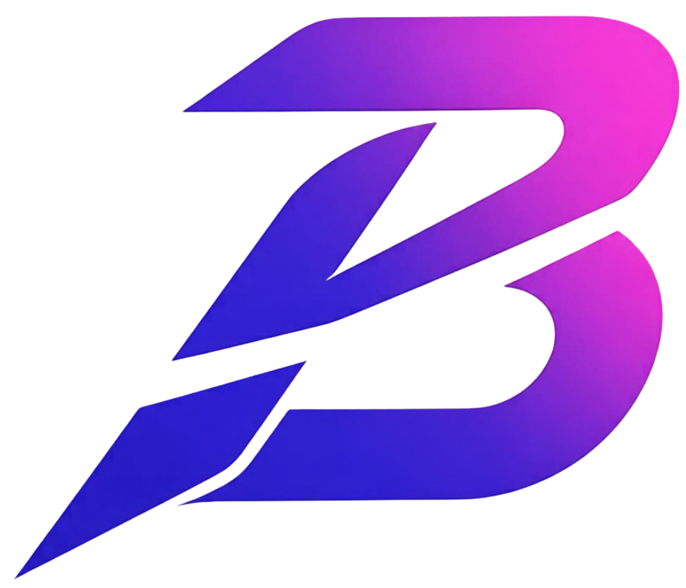

<p align="center">
  
</p>

<h1 align="center">BlinkStream</h1>

<p align="center">
  <strong>Next-Generation Desktop Client for Twitch — Lightweight, Cross-Platform, and Ultra-Fast</strong>
</p>

<p align="center">
  
  
  
  
</p>

---

## ✨ Features

### v1.4.2 — Twitch reliability and integrated Drops (release preparation)

The source version is **1.4.2**; the latest published release remains **1.4.1**.
A source push does not publish installers or enable an update to 1.4.2.

- **Integrated Drops:** native progress and official Twitch inventory share one panel, without a
  separate claim window. The panel and polish were accepted in a Windows user session. Claims
  still require Twitch integrity checks and any game-account linkage.
- **Experimental watch reporting:** opt-in reports measure actual native playback and pause when
  playback stops or the app is hidden. Only Twitch-confirmed inventory counts as earned progress;
  accepted reports alone do not prove credit. No second official player is opened.
- **Safer Auto-Claim:** uncertain claims persistently pause automation instead of reopening windows.
  General panel acceptance is not separate proof of automatic clicking in every campaign.
- **EventSub rewards:** custom redemption events replace retired PubSub, with creator authorization,
  connection states, deduplication and cleanup. A real authorized redemption test remains pending.
- **UI reliability:** stale search responses cannot reopen dismissed results; player shortcuts respect
  interactive controls/modals; Drops restores React focus and highlights the active pane.
- **Update safeguards:** CI verifies every updater artifact and its trusted comment before publishing
  a complete release. The current signing key matches configured trust; historical installers still
  require migration/upgrade validation. No key has been replaced.
- **Security maintenance:** JavaScript audit is clean and rustls is patched. The Linux GTK/GLib
  advisory still requires an upstream-compatible fix; see the verification guide.

See [release notes](RELEASE_NOTES.md), [roadmap](ROADMAP.md) and
[updater verification](docs/guides/UPDATER_VERIFICATION.md) for validation limits and release blockers.

| Feature | Description |
|---------|-------------|
| 🌍 **Global Localization** | Core interface supports 8 languages (ES, EN, FR, DE, PT, JA, KO, RU); new experimental screens may still contain Spanish copy |
| 💬 **Twitch Popout Chat & Channel Points** | Official native Twitch popout chat integrated directly into the workspace or as an Always-on-Top floating window with full Channel Points, reward redemption, and emotes |
| 🛡️ **Pro Mod View Workspace** | Dedicated multi-dock command center (`Ctrl+M`) with live mod logs, AutoMod queue, unban appeals, active viewers, predictions, and channel point redemptions |
| ⚡ **Low Latency (LL-HLS)** | Live-edge synchronization, dynamic catchup and one-click live resync; latency depends on stream/network conditions |
| 💬 **Rich IRC Chat & Badges** | Real-time chat with 7TV/BTTV/FFZ emotes, optimistic badge rendering (Sub, Mod, VIP, Founder, Turbo), and custom colors |
| 🎮 **Gamer Chat Overlay (HUD)** | Transparent always-on-top HUD with click-through and opacity controls to read chat over full-screen games |
| 🌧️ **Emote Rain & Combos** | Floating real-time emote particle overlays and dynamic neon Combo meter (HYPERS, SUPER, GODLIKE) |
| 🔔 **Smart Chat Tabs** | Quick navigation bar filtering between All messages, @Mentions with live counter, and ⭐ Featured events |
| 📺 **Live Streams** | Smooth Twitch stream playback using integrated Streamlink + FFmpeg engine |
| 🎬 **Clips & VODs** | Dedicated video-on-demand and clip player with selectable multi-quality tiers |
| 📼 **Local Recording** | Built-in live recording system with automatic disk space monitoring and background encoding |
| 🔐 **OAuth Authentication** | Secure Twitch login powered by Supabase Edge Functions with state-of-the-art token security |
| ⭐ **Cloud Sync Favorites** | Synchronize favorite streamers and custom watchlists securely via cloud storage |
| 🎨 **Theme Studio** | Deep theme customization (AMOLED Black, Cyberpunk Gold, Emerald) with selectable Google Fonts |
| 📊 **Pro Telemetry (Nerd Stats)** | Real-time live HUD measuring exact live broadcast delay, RAM buffer ahead, bitrate, resolution, FPS, and dropped frames |
| 📱 **Mobile Wi-Fi Remote** | Control playback, channel switching, and volume wirelessly from any smartphone or tablet |
| 🔒 **Hardened Security** | Strict Content Security Policy (CSP), rustls TLS, and secure OS keychain storage |
| 🔄 **Over-The-Air Updates** | Background/manual checks, user-confirmed installation and signature verification via GitHub Releases; signing compatibility currently blocks release readiness |

---

## 📦 Installation

### Windows
Download an already published installer from [GitHub Releases](https://github.com/BlinkStreamApp/BlinkStream/releases/latest).
Version 1.4.2 is not published yet. Updates require a compatible signing key and your confirmation.

- ⭐ **`BlinkStream_1.4.1_Win_x64.exe`** *(NSIS installer)*
- `BlinkStream_1.4.1_Win_x64.msi` *(Enterprise MSI installer)*

> [!NOTE]  
> **Windows trust warnings:** binaries are not Authenticode-signed. Updater signatures do not replace
> Windows code signing. A Defender detection must not be assumed to be a false positive: keep
> protection enabled and investigate the file and its provenance before running it.

### macOS
```bash
brew install streamlink
# Download the published macOS arm64.dmg (Silicon) or x64.dmg (Intel) from Releases
```

### Linux (Debian / Ubuntu)
```bash
sudo apt install streamlink
# Download the published Linux x86_64.deb or .AppImage from Releases
```

---

## 🔨 Building from Source

### Prerequisites
- **Node.js** 22+
- **pnpm** 10+
- **Rust** 1.88.0+ (pinned in `rust-toolchain.toml`)
- **Streamlink** (installed and globally available in PATH)

### Windows
```powershell
winget install Streamlink.Streamlink
pnpm install
pnpm build
pnpm tauri build
```

### macOS
```bash
brew install streamlink
pnpm install
pnpm build
pnpm tauri build --bundles app
```

### Linux
```bash
sudo apt update && sudo apt install -y libwebkit2gtk-4.1-dev build-essential curl wget file libxdo-dev libssl-dev libayatana-appindicator3-dev librsvg2-dev
pnpm install
pnpm build
pnpm tauri build
```

---

## 📄 License
Distributed under the **MIT License**. See `LICENSE` for more information.
